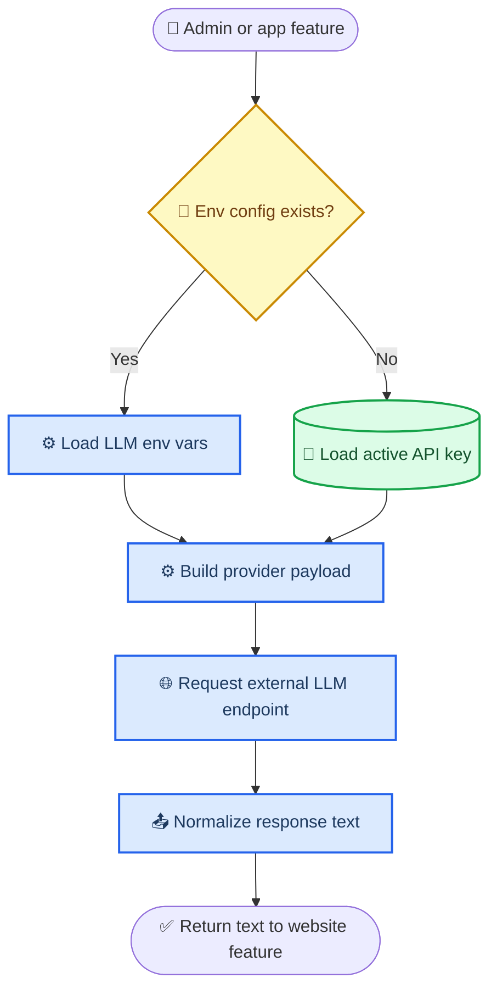
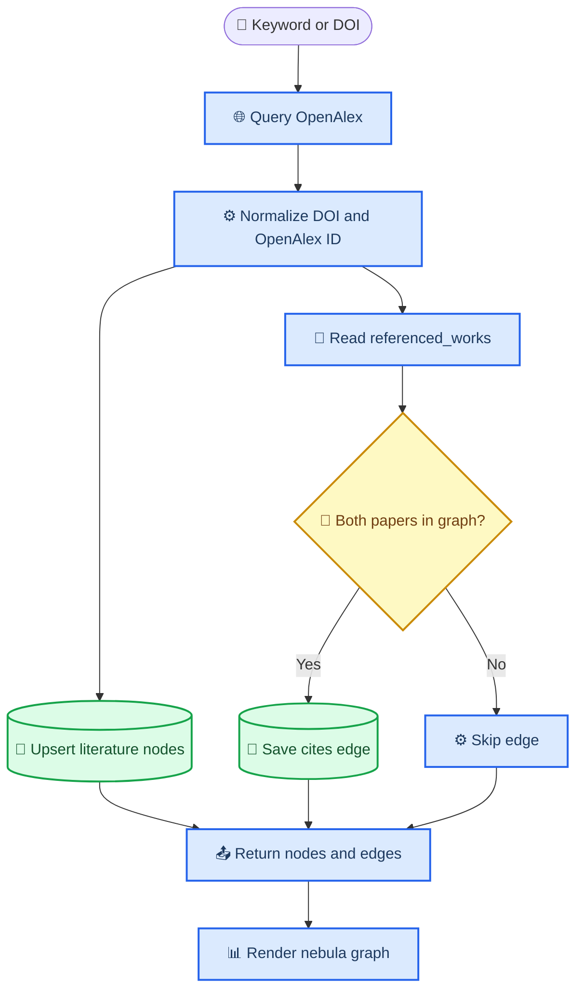

# 独立 API 与文献引用星云实现说明

_本文档说明本项目为“脱离 Codex 独立调用模型 API”和“真实文献引用星云图谱”两个任务所做的设计、实现与验收方式。_

---

## 📋 总览

本次实现把网站从“依赖 Codex 会话中的模型能力”改成“由网站自己保存或读取 API Key，并直接请求外部模型网关”。同时，文献图谱不再使用示例论文或主题相似度模拟边，而是通过 OpenAlex 获取真实论文元数据，并且只根据论文明确列出的参考文献关系生成有向引用边。

星云图中的颜色含义如下：

| 视觉元素 | 含义 | 实现规则 |
| --- | --- | --- |
| 节点颜色 | 文献主题 `topic` | 同一主题会稳定映射到同一种颜色 |
| 节点大小 | 被引次数 `citation_count` | 被引越多，节点越大 |
| 连线箭头 | 引用方向 | 箭头从“引用文献”指向“被引用文献” |
| 双击节点 | 打开来源 | 优先打开论文 URL，其次打开 DOI 链接 |

当前颜色调色板在 `static/js/nebula.js` 中定义为：

```text
#3b82f6, #10b981, #f59e0b, #8b5cf6, #ec4899, #06b6d4, #84cc16
```

这些颜色不是质量等级，也不是文献类型；它们只是按主题分组，帮助用户在星云图中识别同一主题簇。

---

## 🌐 独立 API 运行设计

### 目标

网站启动后，即使没有 Codex 参与，也能通过用户配置的 API Key 调用外部 LLM，用于知识点生成、Agent 对话、文献辅助分析等功能。

### 配置入口

系统支持两种配置方式，优先级从高到低：

| 方式 | 适用场景 | 配置位置 |
| --- | --- | --- |
| 环境变量 | 本地部署、服务器部署、避免密钥进入数据库 | `.env` 或系统环境变量 |
| 后台页面 | 管理员在网页中维护模型配置 | `/admin/api-keys` |

环境变量优先于数据库配置。只要设置了 `LLM_API_KEY`、`LLM_API_ENDPOINT`、`LLM_MODEL`，系统会优先使用环境变量中的配置。

### 关键配置项

| 配置项 | 说明 | 示例 |
| --- | --- | --- |
| `LLM_PROVIDER` | 提供方标识 | `shanghaitech` |
| `LLM_API_ENDPOINT` | 模型网关地址 | `https://genaiapi.shanghaitech.edu.cn/api/v1/start` |
| `LLM_API_KEY` | 模型密钥 | 不写入仓库 |
| `LLM_MODEL` | 模型编码 | `GPT-5.5` |
| `LLM_DEPLOYMENT` | 部署节点 | `east-US-2-gpt-5.5` |
| `LLM_API_STYLE` | 请求格式 | `auto` |

`.env.example` 只保留占位值，不包含真实密钥。

### 请求兼容策略

`llm_client.py` 提供统一的模型调用层，屏蔽不同网关之间的差异：

| API 风格 | 用途 |
| --- | --- |
| `chat_completions` | 标准 Chat Completions 兼容接口 |
| `responses` | Responses 风格接口 |
| `start` | 自定义 `/start` 网关 |
| `auto` | 先尝试标准格式；如果 `/start` 网关返回格式类错误，再尝试 Start 格式 |

请求时会同时提供常见鉴权头：

```text
Authorization: Bearer <key>
api-key: <key>
X-API-Key: <key>
```

这样做是为了兼容不同学校、云厂商或代理网关的鉴权习惯。

### API 调用流程



### 安全设计

真实 API Key 不写入文档、不写入 `.env.example`、不提交到 Git。用户可以在本地 `.env` 或后台数据库中配置密钥。由于密钥曾经出现在聊天文本中，建议在模型平台重新生成新密钥，并废弃旧密钥。

---

## 📊 文献检索与引用星云设计

### 目标

图谱必须满足三个要求：

- 能根据关键词或 DOI 检索真实文献
- 能保存 DOI、OpenAlex ID、标题、作者、期刊、年份、摘要、被引次数等元数据
- 引用边必须来自真实参考文献关系，不根据主题相似度或关键词相似度伪造

### 数据来源

文献检索与引用关系来自 OpenAlex。系统使用 DOI 和 OpenAlex ID 作为主要去重键；如果论文没有 DOI，则使用 OpenAlex ID 保持唯一性。

### 检索策略

| 查询类型 | 行为 |
| --- | --- |
| 关键词 | 搜索相关论文，再补充这些论文共同引用的连接文献 |
| DOI | 获取 DOI 对应论文，再获取其参考文献和引用它的论文 |
| 空查询 | 展示本地数据库已同步的文献和引用边 |

OpenAlex 返回的 `referenced_works` 是引用边的唯一来源。系统不会用“主题相似”“标题相近”“同一关键词”来创建引用关系。

### 存储模型

| 表 | 作用 | 关键字段 |
| --- | --- | --- |
| `literature_items` | 保存文献节点 | `doi`, `openalex_id`, `title`, `citation_count`, `topic` |
| `citation_links` | 保存有向引用边 | `source_id`, `target_id`, `relationship='cites'` |
| `api_keys` | 保存后台模型配置 | `endpoint`, `model_name`, `deployment`, `api_style` |

系统启动时会执行轻量 schema 升级，为旧 SQLite 数据库补齐 `openalex_id`、模型端点、模型编码、部署节点、API 风格等字段，并为引用边创建唯一索引，避免重复边。

### 图谱生成流程



### 前端星云渲染

`/nebula` 页面通过 `/api/nebula-data` 获取 JSON 数据，然后用 `vis-network` 渲染：

| 字段 | 渲染用途 |
| --- | --- |
| `id` | 节点唯一标识 |
| `label` | 图上短标题 |
| `title` | 鼠标悬停提示 |
| `topic` | 节点颜色分组 |
| `citation_count` | 节点大小 |
| `doi` / `url` | 双击打开来源 |
| `source` / `target` | 有向引用边 |

Agent 引用网络页 `/agent/citation` 也补充了同样的文献详情展示。生成图谱后，点击 Top 5 枢纽文献或图中节点，可以看到标题、DOI、OpenAlex、期刊、年份、作者、引用数和来源链接。

---

## ✅ 验收方式

### API 独立运行

1. 复制 `.env.example` 为 `.env`
2. 填入 `LLM_API_ENDPOINT`、`LLM_API_KEY`、`LLM_MODEL`、`LLM_DEPLOYMENT`
3. 启动 Flask
4. 登录管理员账号，进入 `/admin/api-keys`
5. 使用“测试连接”验证模型接口

也可以完全不使用后台配置，只依赖 `.env`。这更适合部署环境。

### 文献星云图谱

1. 登录网站
2. 打开 `/nebula`
3. 输入关键词，例如 `protein design`
4. 点击“搜索并生成图谱”
5. 检查节点数、真实引用关系数、研究主题数
6. 双击节点，确认能打开 DOI 或来源链接

### Agent 引用网络详情

1. 打开 `/agent/citation`
2. 输入关键词或 DOI
3. 生成图谱
4. 点击“枢纽文献 Top 5”或图谱节点
5. 确认页面展示 DOI、OpenAlex、标题、期刊、年份、作者、引用数等信息

---

## ⚠️ 边界与注意事项

- OpenAlex 网络不可用时，检索接口会返回错误，不会生成假数据兜底。
- 有些论文没有 DOI，此时仍可用 OpenAlex ID 做唯一标识。
- 图谱边只在源论文和目标论文都进入当前图谱时显示，因此边数可能少于论文全部参考文献数量。
- 节点颜色只表示主题分组，不表示论文重要性；重要性由节点大小和引用数体现。
- 本地提交不等于 GitHub 已更新。当前如果 `git status` 显示 `ahead`，说明还需要完成 `git push`。

---

## 🔗 主要实现位置

| 文件 | 作用 |
| --- | --- |
| `llm_client.py` | 独立 LLM API 客户端、请求格式兼容、响应解析 |
| `app.py` | API 配置路由、星云数据接口、schema 升级 |
| `models.py` | 文献、引用边、API Key 数据模型 |
| `openalex_client.py` | OpenAlex 检索、DOI 规范化、引用图构建 |
| `literature_agent.py` | 文献同步、去重、引用边持久化 |
| `static/js/nebula.js` | 星云图谱渲染、颜色、节点大小、双击打开来源 |
| `templates/agent_citation.html` | Agent 引用网络详情展示 |
| `.env.example` | 独立部署环境变量模板 |

